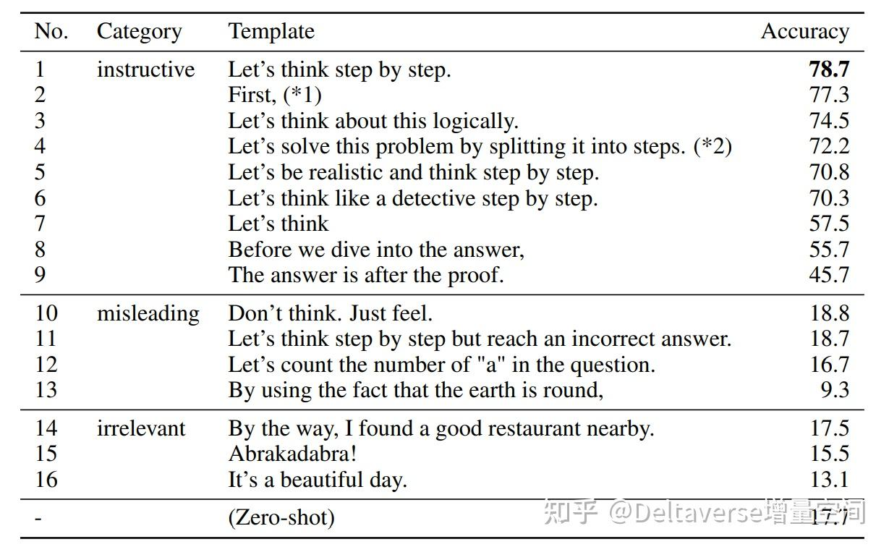
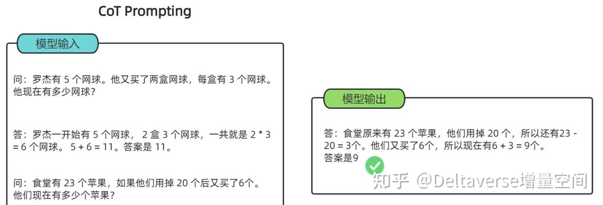
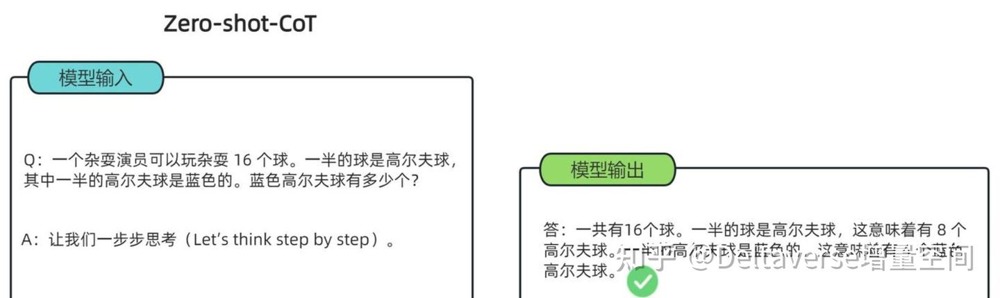
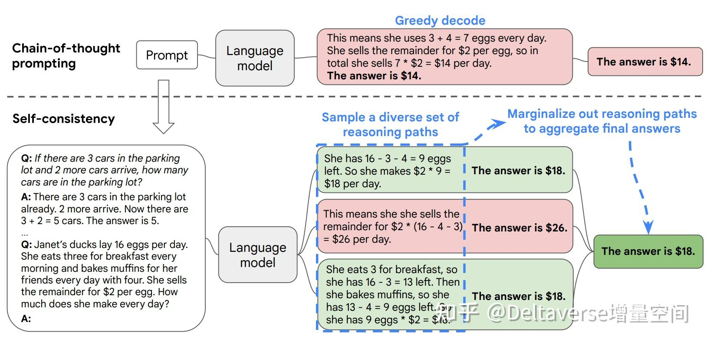
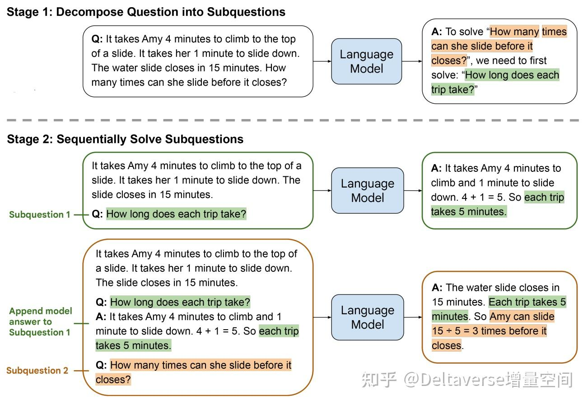
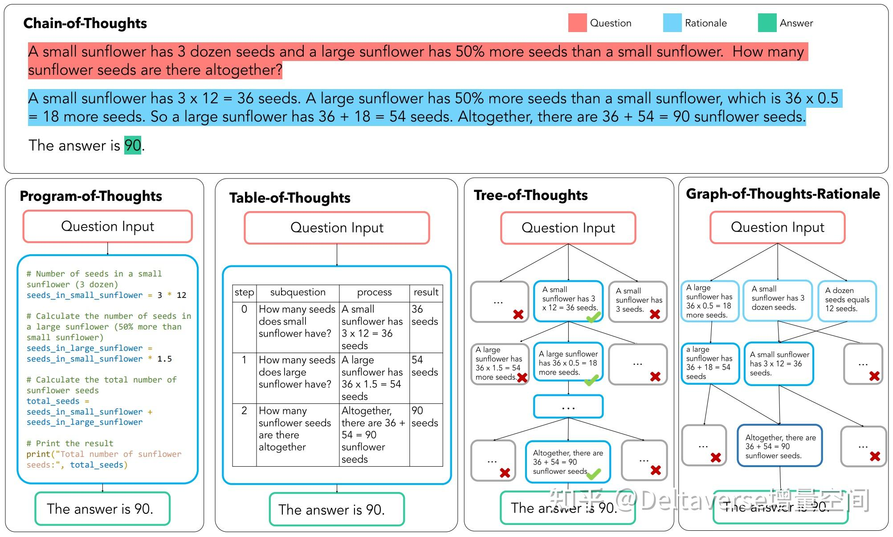
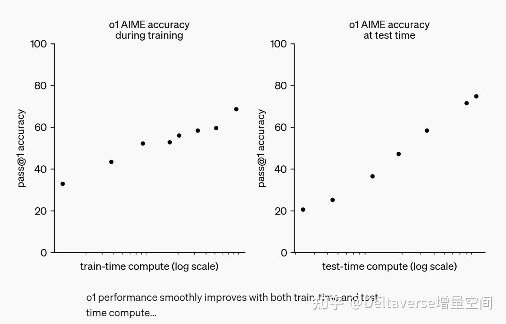
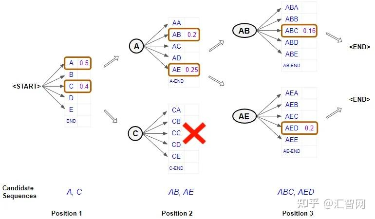
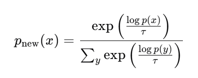
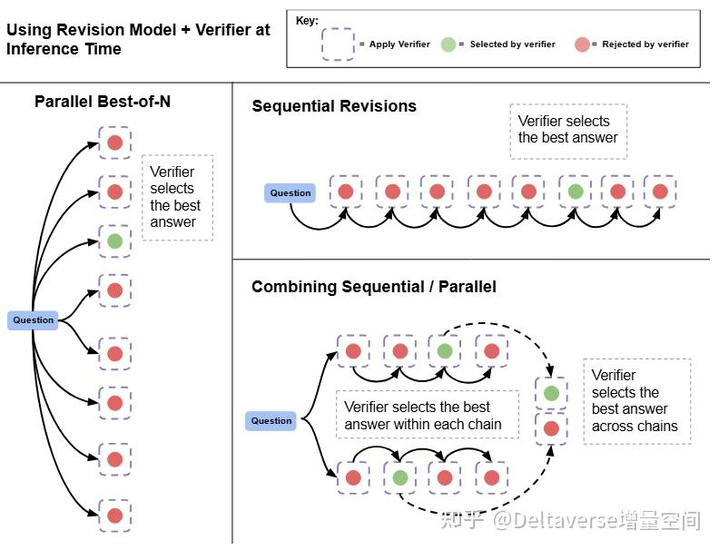

# COT

## 起源
在数学问题、逻辑推理等任务， 使用提示词类似于"一步步思考"（step-by-step thinking）就能显著提升模型在其任务上的体现，因此出现了专门针对逻辑推理的模型[如：chatgpt-o1]. 实验也证明特定且合适的提示词能正确激活模型推理能力，[提升模型表现](https://arxiv.org/pdf/2205.11916)：

## 基本形式
1. Few-shot CoT
该模式下，一般给出一些类似的含有具体逻辑推理过程的示例，然后在问出具体问题，引导模型学习推理模式，适用于复杂任务和特定领域问题：

2. Zero-shot CoT
在提示中加入特定关键词，如“Let's think step by step”，激活模型的推理能力，适用于相对简单的推理任务：

3. Self-consistency CoT
prompt给出多个路径的推理，激活LLM从多个推理路径得到答案，然后通过多数表决或一致性检查选择最可靠的答案，从而提高推理结果的可靠性,代表论文为：[Self-Consistency Improves Chain of Thought Reasoning in Language Models](https://arxiv.org/pdf/2203.11171)

4. least to most prompting
将复杂问题分解成一系列更简单的子问题，然后逐步解决

## 进阶形式：
$Prompt 模式$
### 自动指令生成
1. (APE)[https://arxiv.org/pdf/2211.01910]

2. (OPRO)[https://arxiv.org/pdf/2309.03409]

### 自动示例生成
1. (Auto-CoT)[https://arxiv.org/pdf/2210.03493]

2. (Automate-CoT)[https://arxiv.org/pdf/2302.12822]

$CoT结构$

## Scaling Law
train-time scale law:增加模型强化学习的训练计算量和模型性能提高关系
test-time scale law：模型在推理/测试时的思考时间(测试时的计算量)和模型性能提高关系

## Reward
ORM->(PRM)[https://arxiv.org/pdf/2408.03314]
1. 搜索模型类型
- Best-of-N weighted: 独立采样N个完整的答案，然后使用PRM对每个答案进行评分,然后对所有得到相同最终答案的解决方案，将它们的验证器分数进行累加，最后选择累加总分最高的答案作为最终输出
- Beam search[束搜索](https://zhuanlan.zhihu.com/p/716903009): 波束宽度为N的贪婪搜索
具体过程：如下例子，选择两个备选，然后用两个解码器生成对应下一步的概率，然后对于每一组，选最大得分的两个解码解码相加，选择概率相加最大的一对作为备选，然后重复该过程。

- Loogahead Search:从当前步骤开始，向前推进k步（如果提前到达解决方案终点则停止）。为了减少模拟中的随机性，这个前瞻过程使用温度为0的采样。最后使用模拟终点的PRM预测分数来评估当前步骤的价值。
- 温度采样：推理时，对于生成的token的概率分布，使用不同温度进行分布调节，然后使用top-p(如0.95)的方式来选择不同的生成结果，形成多条结果，使用温度为 0.6 和 top-p 值为 0.95 的设置，可以生成 4 到 64 个不同的答案。

2. 训练技巧：
构建一个包含"错误答案序列+正确答案"的训练数据集：字符编辑距离来选择相关性较高的错误答案。训练得到revision model，可以将错误答案修正为正确答案。同时为了抑制将正确答案改成错误答案，还需要使用best-of-N来从模型生成的一系列修正中筛选最佳答案。

## 效能提升
Compute Optimal Predicted: 使用 PRM（过程奖励模型）的预测分数来评估问题难度。具体来说，它会对每个问题采样多个答案，然后根据 PRM 对这些答案的评分来估计问题的难度，来决定应该使用什么样的搜索策略：对于简单问题可能选择使用 best-of-N，而对于中等难度的问题可能选择使用束搜索。
结构：parallel + sequential

